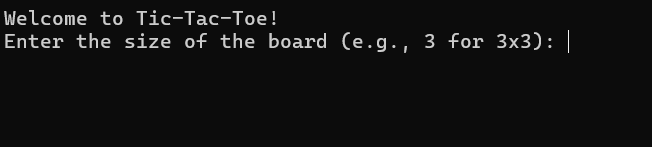
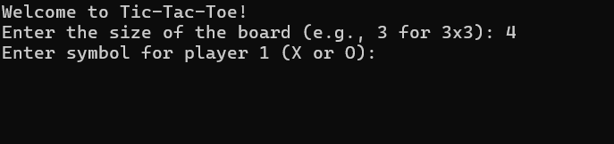
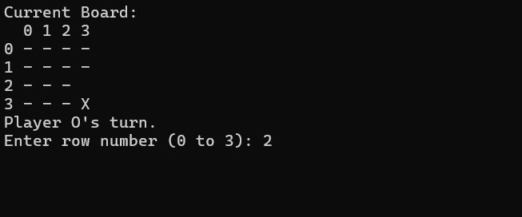
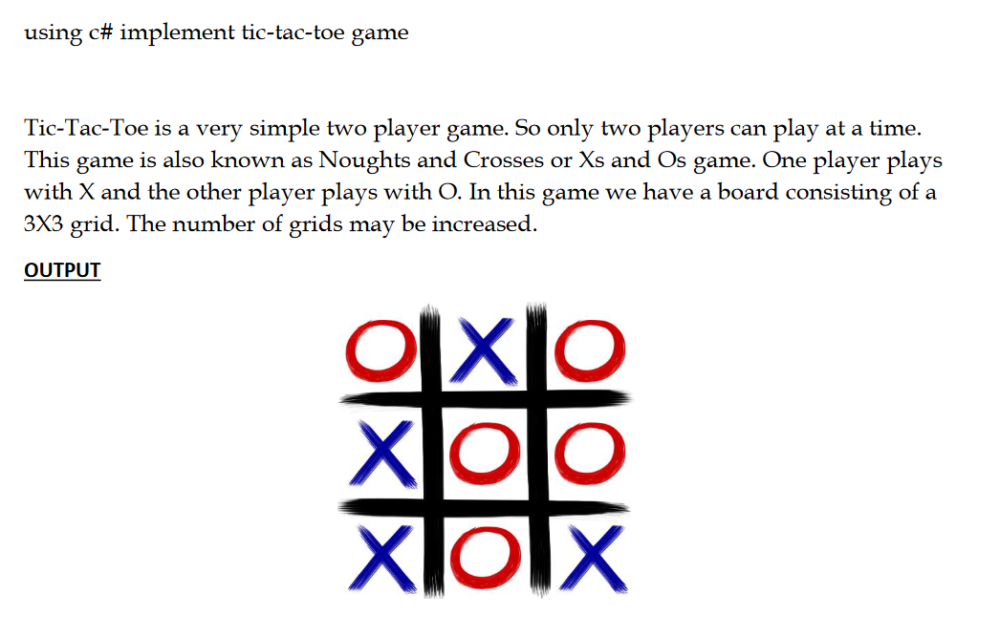

# Tic-Tac-Toe Game

This is a console-based Tic-Tac-Toe game implemented in C#. It allows two players to play the classic game on a customizable square board of any size. Players can choose their symbols (X or O) and enjoy a user-friendly gaming experience.







## Features

- **Customizable Board Size**: Players can choose the size of the board, allowing for variations of the game such as 3x3, 4x4, or even larger.
- **Player Symbol Selection**: Players can select their symbols (X or O) before starting the game.
- **Win Condition Detection**: The game detects when a player wins by getting three of their symbols in a row (horizontally, vertically, or diagonally).
- **Draw Detection**: The game detects when the board is full and no player has won, resulting in a draw.
- **Rematch Option**: After a game ends, players have the option to play again without restarting the application.
- **Input Validation**: Validates user input to ensure that moves are within the bounds of the board and are in the correct format.
- **Clear Console Screen**: Clears the console screen before printing the current state of the board, providing a cleaner and more visually appealing interface.
- **Display Board Coordinates**: Displays row and column numbers on the board to help players easily identify positions for their moves.
- **Error Handling**: Provides informative error messages for invalid inputs and gracefully handles exceptions.
- **Optimized Win Checking**: Uses an optimized algorithm to check for win conditions, improving performance especially for larger board sizes.

## Getting Started

### Prerequisites

- [.NET Framework](https://dotnet.microsoft.com/download) installed on your system.
- Add C# compiler to path (WinOS users - https://www.youtube.com/embed/QYNhb67qvv4)

<iframe width="916" height="515" src="https://www.youtube.com/embed/QYNhb67qvv4" title="How to set the path of the C# compiler(CSC) on Windows 11 and 10 to compile C# programs on CMD" frameborder="0" allow="accelerometer; autoplay; clipboard-write; encrypted-media; gyroscope; picture-in-picture; web-share" allowfullscreen></iframe>

### Game Installation

1. Clone the repository to your local machine:

   ```sh
   git clone https://github.com/stevemats/TicTacToe.git
   ```

2. Navigate to the project directory:

   ```sh
   cd TicTacToe
   ```

3. Compile the C# code using the .NET compiler:
   ```sh
   csc Program.cs TicTacToe.cs
   ```

- Where Program.cs is the name for c# file with the project. Replace with your file name if you update it.

### Usage

1. Run the executable file to start the game:

   ```sh
    tictactoe.exe
   ```

- Your executable will have a name similar to your script name if you compiled with CSC. In this case it is 'tictactoe.exe'.

2. Follow the on-screen instructions to select the board size, choose player symbols, and make moves.

3. Enjoy playing the with a friend.

## Improvable Areas(Feel free to create a PR):

- Implement an AI opponent for single-player mode.
- Add support for custom player names.
- Enhance the UI with graphical elements.
- Implement network multiplayer mode to play with friends online.

## Some Background Knowledge About Tic-Tac-Toe Game:


> Your best friend asks you if you want to play a game, and you reply, "Sure!" She grabs a piece of paper and a couple of pencils. After marking two vertical lines on the paper, she crosses them with two horizontal lines to make a three-by-three grid with nine squares. When she marks an X in the center square, it's game on!

> What are you playing? That depends upon where you live. If you live in England, you probably call it noughts and crosses. If you're in Canada or Ireland, you might call it Xs and Os. If you're in the United States, though, you're definitely playing tic-tac-toe!

> No matter what you call it or how you spell it (tick-tack-toe is also acceptable), tic-tac-toe is an ancient game that billions of people have played over the course of history. While some experts believe the game dates back to the ancient Egyptians, others believe it evolved from an ancient Roman game called Terni Lapilli.

> Terni Lapilli was played on a similar three-by-three grid. In fact, these grids can be found scratched onto all sorts of surfaces around ancient Rome. However, no markings have ever been found within the grids, leading historians to believe the game was played with movable pieces rather than by making markings, such as Xs and Os.

<details>
  <summary>Continue reading</summary>

> Experts believe the name tic-tac-toe came about sometime in the 1800s. That's when a popular game called either "ticktack" or "tic-tac-toe" was played by blindly throwing a pencil at a slate marked with numbers. Your score was tallied by counting the numbers hit with the pencil. This game is no longer played today, but its name survives nonetheless. Historians believe the name derived from the sound the pencil made when it hit the slate.

> The modern game we know as tic-tac-toe is played on a nine-square grid created by drawing lines to create three horizontal rows and three vertical columns. With X going first, players alternate marking the squares with Xs and Os, trying to achieve three marks in a row either horizontally, vertically, or diagonally.

> Tic-tac-toe is interesting to mathematicians, because its small grid and simple game play can be used to teach simple mathematical principles, such as probability. For example, did you realize that there are 362,800 unique ways to place Xs and Os into the grid?

> Of those combinations, 255,168 of them are possible winning combinations. However, if you eliminate all the symmetrical combinations, there are only 138 unique winning combinations. With this few winning combinations, tic-tac-toe is a relatively easy game to play, making it popular with children. Most players quickly learn that two good tic-tac-toe players will settle into playing to a draw repeatedly. [//Source: Wonderpolis](https://wonderopolis.org/wonder/how-old-is-tic-tac-toe)

</details>

## Original Quiz That Led Me To Create The Game:



## Credits

This Tic-Tac-Toe game was created by [Steve Matindi](https://github.com/stevemats/TicTacToe). Feel free to contribute to it by submitting bug fixes, enhancements, or new features via pull requests[(PR)](https://docs.github.com/en/pull-requests/collaborating-with-pull-requests/proposing-changes-to-your-work-with-pull-requests/creating-a-pull-request).
